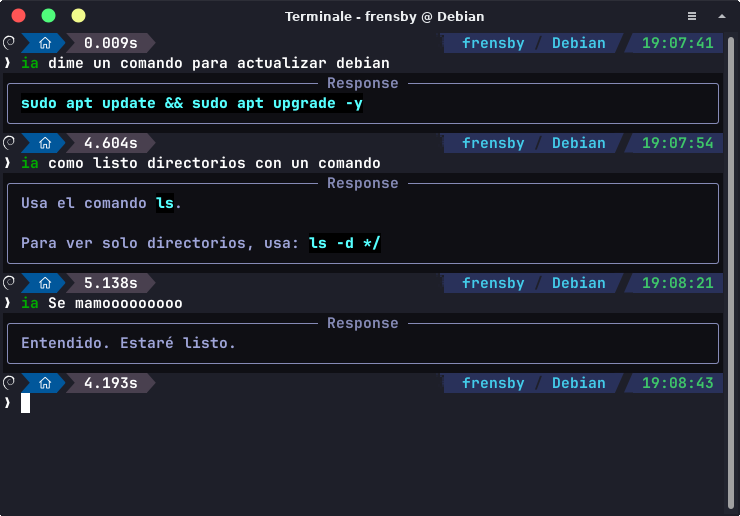

# Proyecto IA Terminal



La idea es realizar una pregunta rápida a la IA directamente desde la terminal y obtener una respuesta veloz *(¡sigo trabajando en optimizarla!)*.

---

## 🚀 Capacidades Actuales (Agentic AI)

El proyecto ha evolucionado de un simple chat a un **Agente Autónomo**. Ahora la IA no solo responde, sino que interactúa directamente con tu sistema Linux mediante el uso de herramientas (`Function Calling`):

- **Ejecución de Comandos:** Puede ejecutar comandos de shell para diagnosticar, instalar o configurar el sistema.
- **Gestión de Archivos:** Capacidad para leer, escribir y listar directorios en tiempo real.
- **Conciencia del Entorno:** Obtiene información detallada del hardware y el SO (CPU, RAM, Kernel, Disco) para adaptar sus respuestas.
- **Memoria Persistente:** Mantiene un historial de contexto en un archivo JSON para no olvidar qué estabas haciendo entre sesiones.

---

## Instalación y Configuración

Sigue estos pasos para dejar el script listo y accesible desde cualquier directorio:

1. **Configurar la API Key:**  
   Define tu clave de API exportando la variable de entorno `GEMINI_API_KEY` (puedes agregarlo a tu `~/.bashrc` o `~/.zshrc`):
   ```bash
   export GEMINI_API_KEY="tu_api_key_aqui"
   ```

2. **Ajustar rutas:**
   Abre el archivo `ia` y configura la ruta al entorno virtual de este repositorio junto con la ruta de ejecución del script principal.

3. **Mover al PATH:**
   Otorga permisos de ejecución y mueve el archivo `ia` a `/usr/local/bin/`:
   ```bash
   chmod +x ia
   sudo mv ia /usr/local/bin/
   ```

> ⚠️ **Nota sobre modelos:** El script utiliza por defecto el modelo `gemma-4-26b-a4b-it`. Si quieres usar un modelo diferente o cambiar de proveedor, toca ensuciarse las manos y modificar el código... ¡que para algo es OpenSource!

---

## Comandos del Sistema

El script incluye comandos especiales para controlar el flujo y detalle de las respuestas al vuelo:

| Comando | Descripción |
| --- | --- |
| `/etc` | **Desactiva** la función de brevedad predeterminada para recibir respuestas extendidas y detalladas. |
| `/bla` | **Reactiva** la función de brevedad para volver a obtener respuestas cortas y directas al grano. |

---

## Estructura del Proyecto

- `src/main.py`: Orquestador principal, gestión de memoria y bucle de herramientas.
- `src/tools_registry.py`: Mapeo de funciones y esquemas JSON para la API.
- `src/tools/`: Módulos especializados en comandos, sistema de archivos e información del sistema.

---

## Personalización

Puedes ajustar la personalidad, el tono, el formato o las reglas del modelo modificando el parámetro `system_instruction` dentro del archivo `main.py`.

---

*Nota: Ojalá al que lea esto le salga un error inesperado en la distro... y que tenga que reinstalar el sistema.* 🐧🔥
